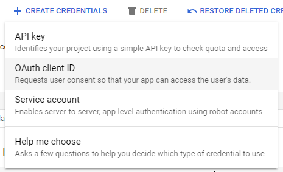

# Setting up OAuth in React (JavaScript)

_Source:_ [BlogRocket](https://blog.logrocket.com/guide-adding-google-login-react-app/)

1. Create a react project
   1. Choose name
   2. React
   3. JavaScript

```pwsh
npm create vite@latest
```

2. Create a google client

   1. go to `https://console.cloud.google.com/`
   2. log in and go to `APIs and services`
   3. Start new project
      
      _Top left `LloydElery`_

3. Oauth concsent screen

   1. `external`
   2. `create`
   3. Add app information `http://localhost:5173`

4. Add a scope

   1. Select profile information and email
      

5. Test users

   1. Add a email you own

6. Create Web Client ID

   1. Credentials
      
   2. Create Credentials
      
   3. Oauth Client Id
   4. Web application
      
   5. Name
   6. JS Origin = `http://localhost:5173` and `http://localhost`
   7. Redirect = `http://localhost:5173` and `http://localhost`
   8. Create (dont close)

7. Install the OAuth package from Google in your react app

```pwsh
npm install @react-oauth/google@latest
```

8. in `main.jsx`
   1. Add this code
   2. Change clientId to your client id
   3. Paste your ClientID after `clientId`

```jsx
import React from "react";
import ReactDOM from "react-dom/client";
import App from "./App.jsx";
import "./index.css";
import { GoogleOAuthProvider } from "@react-oauth/google";

ReactDOM.createRoot(document.getElementById("root")).render(
  <GoogleOAuthProvider clientId="CLIENT ID OVER HERE">
    <React.StrictMode>
      <App />
    </React.StrictMode>
  </GoogleOAuthProvider>
);
```

9. in App.js
   1. Add this code

```jsx
import { GoogleLogin } from "@react-oauth/google";

function App() {
  const responseMessage = (response) => {
    console.log(response);
  };
  const errorMessage = (error) => {
    console.log(error);
  };
  return (
    <div>
      <h2>React Google Login</h2>
      <br />
      <br />
      <GoogleLogin onSuccess={responseMessage} onError={errorMessage} />
    </div>
  );
}
export default App;
```

10. Test login

    1. `npm run dev`
    2. Click login (might not work, then just continue)

11. install axios

```pwsh
npm install axios
```

12. in `App.jsx` add this code

```jsx
import { googleLogout, useGoogleLogin } from "@react-oauth/google";
import axios from "axios";
import { useEffect, useState } from "react";

function App() {
  const [user, setUser] = useState([]);
  const [profile, setProfile] = useState([]);

  const login = useGoogleLogin({
    onSuccess: (codeResponse) => setUser(codeResponse),
    onError: (error) => console.log("Login Failed:", error),
  });

  useEffect(() => {
    // If the user is a authorized `user`...
    if (user) {
      axios
        // ...get the profile
        .get(
          `https://www.googleapis.com/oauth2/v1/userinfo?access_token=${user.access_token}`,
          {
            // ...set profile data
            headers: {
              Authorization: `Bearer ${user.access_token}`,
              Accept: "application/json",
            },
          }
        )
        .then((res) => {
          setProfile(res.data);
        })
        .catch((err) => console.log(err));
    }
  }, [user]);

  const logOut = () => {
    googleLogout();
    setProfile(null);
  };

  return (
    <div>
      <h2>React Google Login</h2>
      <br />
      <br />
      {profile ? (
        <div>
          
          <h3>User Logged in</h3>
          <p>Name: {profile.name}</p>
          <p>Email Address: {profile.email}</p>
          <br />
          <br />
          <button onClick={logOut}>Log out</button>
        </div>
      ) : (
        <button onClick={login}>Sign in with Google 🚀 </button>
      )}
    </div>
  );
}
export default App;
```

13. Sign in with google
    1. Look if your information is visible
    2. Not working? Set user to admin
